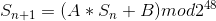
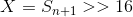
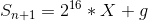
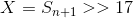
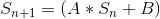
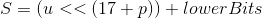
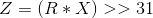
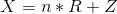

# PRNG Prediction

Some implementations of Pseudo Random Number Generation (PRNG) mechanisms suffer from several known issues.

## Linear Congruent Generator

A particular implementation of PNRG is Linear Congruent Generator (LCG). A famous example is java’s Random() class. The basic principle is that a new Random() object is initiated with a seed dependent on the current time and then, at every call to _Random.nextInt()_ the seed is updated according to this formula:

Where A and B are known coefficients, which can be found in the references. Every time that _nextInt()_ is called, the seed is updated according to the above formula and the output of the function _nextInt()_ is:

This means that only the upper 32 bits of _S_ affect the output of the _nextInt()_ function (Notice that _S_ is at most 48 bits). In this case, having two subsequent observations of _X_ can lead to the discovery of _S_ with a reduced bruteforce attack. In fact, reversing the above equation yields:

Where _g < 216_
One can enumerate all the possible g and then verify which one of these yields the next observation X. A simple proof-of-concept can be found later in the references.

### LCG with fixed Range

In some cases, the function _nextInt()_ is called with a parameter _R_ that is the maximum range of the output. In this case let’s call _Z_ the output of _nextInt(R)_. Then:

  

That is, _X_ is given by the upper 31 bits of _S_, differently from the former case, and then the output observed (_Z_) is given by something dependent on the lower bits of _X_. The point here is that we aren’t leaked directly the upper bits of _S_, instead we’re leaked some information on the lower bits of the 31 upper bits of _S_, depending on the range used.

#### Case with R = 2^p

In this case the operation _Z=X mod R_ gives directly the lowest _p_ bits of _X_. In fact, reasoning in base 2, the modulo operation consists in taking the remainder of _X / 2^p_, i.e. the lowest _p_ bits of _X_.
Example:  
_X = 38 = 32 + 4 = 100100_  
_R = 8 = 2^3_  
  
_X / R = 32/8 + 4/8 = (X >> 3) + Z/8_  
Where _Z_ is the remainder, i.e. the last 3 bits that are lost in the shift operation.  

So, we know that the output of _Random.nextInt(R)_ must be the lowest _p_ bits of _X_, i.e. the lowest _p_ bits of the upper 31 bits of the seed. Equivalently, they are the upper _p_ bits of the lowest _17+p = 20_ (in this example) bits of the seed. We can use this to brute separately the two parts of the seed. Notice that, at every update of the seed, the leaked _p_ bits can be influenced only by the lower ones:

At every multiplication and addition, the operations performed on the lower _17+p_ bits are independent on what happens to the upper _31-p_ bits (i.e. we could split the seed in two parts, upper and lower, and perform the operations only on the lower part and the result would be the same, exploiting the associative property).
If we have a set of subsequent observations, we actually have a set of leaked bits from the seed sequence. It means that is sufficient to guess a _(17+p)_-bits initial seed such that the produced _Sn_ sequence has the observed p-bits. This can be done in seconds.
After determining the lower _17+p_ bits, one can brute the upper ones by simply guessing which seed will give the observed sequence. 

_**Note**_ In the end, what we said here means that the output of _Random.nextInt(R)_ with _R = 2^p_ depends only on the lower _17+p_ bits of the seed. This implies that we don’t even need to know the full seed in order to predict future observations, instead we can just brute the lower _17+p_ bits in some seconds and then we can predict every observation. 

_**To avoid this issue, the actual implementation of java’s Random.nextInt(R) differs from the one described here for R=2^p.**_ Instead the actual computation is:

That is, we take the upper 31 bits of the seed (i.e. the number _X_), we multiply it by _R_ and then divide by _2^31_ and take the integer part. This operation yields a number _Z < R_. (_Z = R_ only if _X_ = 2^31). We still haven’t thought of any attack against this implementation.  

#### Case with R = even

If _R_ is even, then the output of _Z=(X mod R)_ will have the same parity of _X_. In fact

Being _R_ even and _n_ an integer number, _n*R_ is even and thus _Z_ and _X_ must be either both even or both odd. This case then is analogous to the previous one with _p = 1_, i.e. from a sequence of observations we’re only leaked the 18th bit (starting from low), that is the parity bit of _X_ and _Z_, and we must brute the lowest 17 and the upper 30 using the same technique. A simple PoC for this case is provided in this repository (file: _predictJavaRandom.java_).

#### Case with R = odd 

We still don’t know how to attack this case.

# References

* [1] [Java Random Source Code] (http://developer.classpath.org/doc/java/util/Random-source.html)
* [2] [Cracking Java’s Random without RANGE](https://jazzy.id.au/2010/09/20/cracking_random_number_generators_part_1.html)
* [3] [Hints on how to crack LCG with fixed RANGE](https://crypto.stackexchange.com/questions/2086/predicting-values-from-a-linear-congruential-generator) 
